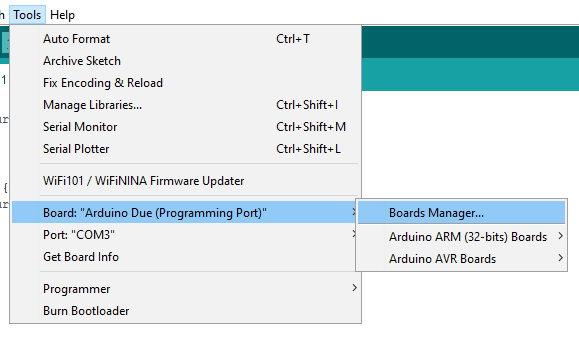
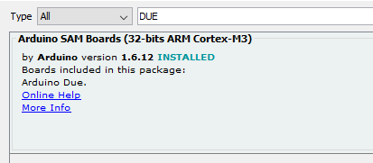
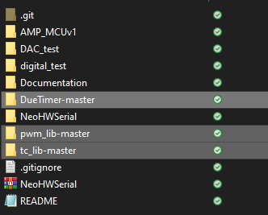
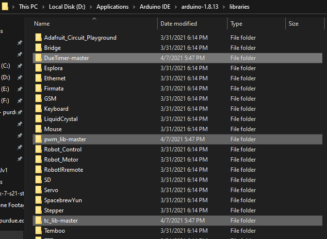

# Wiki
To find documentation for the code found in this repository head to the Electrical Documentation Wiki here: https://github.com/Autonomous-Motorsports-Purdue/Electrical_Documentation/wiki

## Setting up the arduino DUE 
You will need to take the two master files and move them to the same directory that the AMP_MCUv1 is in.
tc_lib-master, and pwm_lib-master

For information setting up the arduino DUE the official guide can be found here: https://www.arduino.cc/en/Guide/ArduinoDue

Basics:
1) plug the Arduino into your pc with the port closest to the DC input
2) navigate in the Arduino IDE to tools>Board>Boards Manager
3) Search DUE and install the package that says: Arduino SAM Boards

After that navigate to tools>Board>Arduino ARM boards>DUE programming port

You will also need to manually tell windows to download the Driver for the DUE.
Following the guide in the link above is best but for a quick overview:
1) Click on the Start Menu and open the Control Panel
2) Navigate to "System and Security". Click on System, and open the Device Manager
3) Look for the listing named "Ports (COM & LPT)". You should see an open port named "Arduino Due Prog. Port"
4) Right click on the "Arduino Due Prog. Port" and choose "Update Driver Software"
5) Select the "Browse my computer for Driver software" option
6) Navigate to the folder with the Arduino IDE you downloaded and unzipped earlier. Locate and select the "Drivers" folder in the main Arduino folder (not the "FTDI USB Drivers" sub-directory). Press "OK" and "Next" to proceed
7) If you are prompted with a warning dialog about not passing Windows Logo testing, click "Continue Anyway"
8) Windows now will take over the driver installation
9) You have installed the driver on your computer. In the Device Manager, you should now see a port listing similar to "Arduino Due Programming Port (COM4)"
And you should be good to go!

## Setting up Libraries
There are 3 libraries you need to add to your arduino IDE
1) DueTimer-master
2) pwm_lib-master
3) tc_lib-master

Find all three of these and move them to your arduino libraries folder

That should be it!
